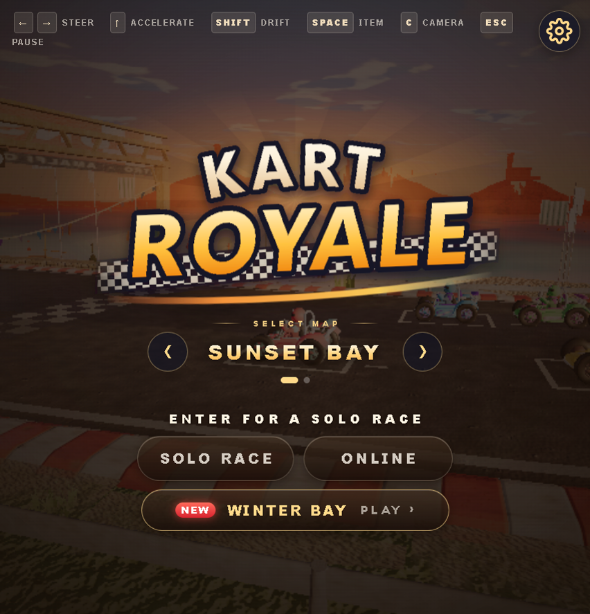
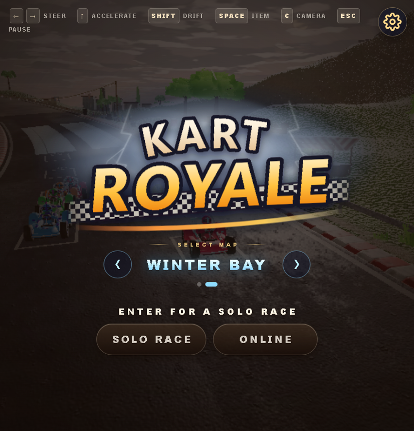
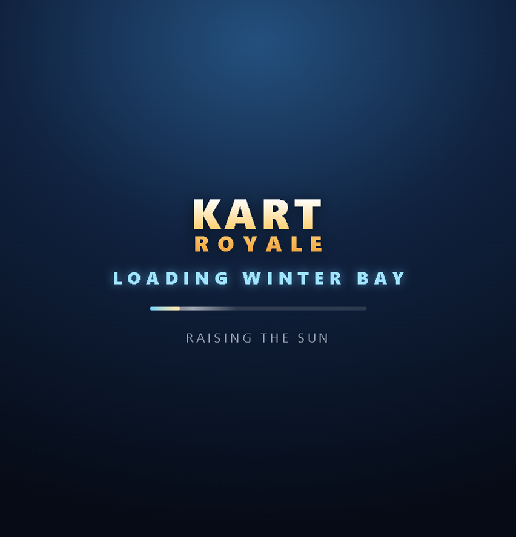
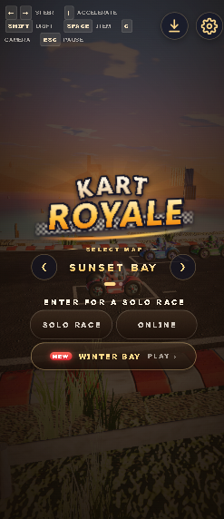

<div align="center">



# 🏁 KART ROYALE · SOS Edition

**A Mario Kart-style racer that runs in the browser: two maps, online multiplayer, and a lightweight mode for phones.**

<br/>

<a href="https://theicd.github.io/SOS--GAME03-BY-kart-royale/"></a>

**Free · Plays in your browser · No download · Desktop and mobile**

<a href="https://theicd.github.io/SOS--GAME03-BY-kart-royale/"></a>&nbsp;&nbsp;<a href="https://theicd.github.io/SOS--GAME03-BY-kart-royale/?map=winter"></a>

<sub>Link: <a href="https://theicd.github.io/SOS--GAME03-BY-kart-royale/">theicd.github.io/SOS--GAME03-BY-kart-royale</a></sub>

<br/>

[](https://github.com/ryancampbell/kart-royale)
[](LICENSE)


</div>

---

## ❤️ Credit

> **This game was created by [Ryan Campbell](https://github.com/ryancampbell).**
> Original repository: **[github.com/ryancampbell/kart-royale](https://github.com/ryancampbell/kart-royale)**.
> You can play the original at [racing.ryancampbell.com](https://racing.ryancampbell.com).
>
> The original is released under the MIT license, and this edition keeps the [`LICENSE`](LICENSE) file unchanged.
> Every mesh, texture, and sound comes from the original project. This edition adds new features and runs faster on phones.
> The original README is kept in full [at the bottom of this page](#-original-readme).

---

## ✨ What's new in the SOS Edition

<table>
<tr>
<td width="50%" valign="top">

### ❄️ New map: Winter Bay
The original circuit under an overcast sky: grey clouds, dim cold sunlight, fog, and dark water.
On the title screen, storm clouds with flickering lightning replace the sun rays behind the logo.

</td>
<td width="50%" valign="top">

### 🗺️ Map picker
Left and right arrows on the title screen switch between **Sunset Bay** and **Winter Bay**.
A **NEW** row under the play buttons announces the new map, and the loading screen shows which map is loading.

</td>
</tr>
<tr>
<td valign="top">

### 🌐 Online multiplayer
Rooms are found through Nostr, and players connect directly over WebRTC.
Up to 4 players plus AI racers per room. Races start when everyone is ready, and you can watch a race that is already under way.

</td>
<td valign="top">

### 📱 Built for phones
A **Lite** graphics mode for weak devices: 30 fps pacing, a lower pixel budget, and fewer plants.
There are also Low, Medium, and High modes. The layout works in portrait, the touch controls are clear, and the game installs as an app (PWA).

</td>
</tr>
<tr>
<td valign="top">

### 🎥 In-car camera
Press `C` or tap **CAM** to switch to a cockpit view. The steering wheel turns with the front wheels.

</td>
<td valign="top">

### 🎵 Sound and settings
Recorded music: a random track in the menu and a different one each race.
Separate volume for music, engine, and effects. All settings sit behind one gear icon.

</td>
</tr>
</table>

---

## 📸 Screenshots

<div align="center">
<table>
<tr>
<td align="center"><br/><sub><b>Sunset Bay</b>: the original map</sub></td>
<td align="center"><br/><sub><b>Winter Bay</b>: storm clouds and lightning</sub></td>
</tr>
<tr>
<td align="center"><br/><sub>Loading screen with the map name</sub></td>
<td align="center"><br/><sub>Portrait layout on a phone</sub></td>
</tr>
</table>
</div>

---

## 🎮 Controls

| Action | Keyboard | Touch |
|---|---|---|
| Steer | `←` `→` | Stick on the left |
| Accelerate | `↑` | Automatic |
| Drift | `Shift` | **DRIFT** |
| Item | `Space` | **FIRE** |
| Camera | `C` | **CAM** |
| Pause | `Esc` | ⏸ |

---

## 🛠️ Run locally

```bash
npm install
npm run dev        # local development
npm run build      # production build into dist/
```

Handy URL options: `?map=winter` opens Winter Bay, and `?quality=lite` forces Lite mode.

---

<div align="center">

**The original game is by [Ryan Campbell](https://github.com/ryancampbell/kart-royale). The SOS Edition changes are by [Theicd](https://github.com/Theicd).**

</div>

---

## 📜 Original README

<details>
<summary><b>Show the original README by Ryan Campbell</b></summary>


# Kart Royale

A Mario Kart-style racer in the browser. **No art assets.** No Blender, no Unity,
no textures, no models, no fonts, no audio files — every mesh, texture, sound and
note is generated in code at load time.

**Play:** [racing.ryancampbell.com](https://racing.ryancampbell.com) ·
**Write-up:** [ryancampbell.com/kart-royale](https://www.ryancampbell.com/kart-royale)


*Every pixel above is generated at runtime. The kerb stripes, the crowd, the tyre
tread, the sparks, the sky — there is not a single image file in this repository.*

Built by Claude Opus 5 from a single prompt, then improved over nine orchestrated
multi-agent rounds.

The prompting technique is the **[Gauntlet Loop](https://somethingbig.ai/gauntlet-loop)**,
named and developed by [Matt Shumer](https://x.com/mattshumer_): give a lead agent a goal and a
concrete example of what great looks like, let it decompose the work into pieces that can be
improved independently, and give each piece a *separate* critic that compares the output against
the bar and sends it back until it clears. The separation of builder and critic is the whole
idea — a builder grading its own homework is not a measurement.

The interesting wrinkle in this project was what happened when the bar could not be used as
stated. See below.

## The prompt

Verbatim, typo and all:

> I want you to build a **kat racing game** at the level of the most recent Mario
> Kart games. It should be utterly perfect, visually beautiful, with every single
> thing done at AAA quality—from textures to physics to anything you could think
> of.
>
> Fan out sub-agents and have sub-agents tackle each one individually so that the
> game is utterly perfect. You should `/loop` on each item and have a separate
> sub-agent check it visually to ensure it looks triple A. That separate sub-agent
> should be a really harsh critic, and if it doesn't look triple A, it should keep
> going.
>
> Don't stop until each sub-agent is utterly wowed with the quality when compared
> with the actual Mario Kart game. It should literally compare them side by side
> blind and say which one looks better. Do this in ThreeJS. `/loop` until it's
> utterly perfect. Fan out sub-agents and ultracode.

### The bar problem

A Gauntlet Loop needs a concrete, inspectable bar. This prompt named one — *compare it side by
side, blind, against the actual Mario Kart* — and that bar could not be used: it would have meant
scraping copyrighted frames, and a model declaring itself the winner of its own comparison is not
a measurement.

So the bar was rewritten as an explicit rubric with hard calibration bands, in
`ART_DIRECTION.md` section 9:

> ```
> 0-40   reads as a programmer-art prototype
> 40-60  a competent hobby project; obviously not commercial
> 60-75  a good indie game; still clearly not first-party
> 75-88  near-professional, but a trained eye spots the tells immediately
> 88-95  genuinely shipped-AAA quality
> ```
> *"Almost nothing deserves 88+ on an early round. If you are inclined to give 85, look harder —
> you are probably missing something."*

That substitution is the single change that made the loop work. A critic told to compare against
a reference it cannot see produces vibes; a critic given calibrated bands and told that generous
scoring produces a worse game produces specific, routable findings — which subsystem, which
frame, which fix.

The second thing that mattered: **the critics judge rendered screenshots from a real headless
build, not source code.** That is what makes them an oracle rather than a second opinion. It is
also where the loop's blind spot lives — see the last item under *Things that went wrong*.

---

## Running it

```bash
npm install
npm run dev      # http://localhost:5173
npm run build    # tsc --noEmit && vite build
```

Useful URL flags:

| flag | what it does |
|---|---|
| `?quality=low\|medium\|high\|ultra` | override the auto-detected tier |
| `?debug=gl` | print a GPU/extension/shader-error report; `__gl()` in the console |
| `?debug=frames` | sample the drawing buffer for partial-black presents |

In the console: `__feel.punchy()` retunes the sense of speed live, `__gl()` dumps
a diagnostic report, `R` records gameplay to a `.webm`.

## What's in here

| | |
|---|---|
| **~60,500 lines** | across 49 source files |
| **4 runtime deps** | `three`, `postprocessing`, `n8ao`, `simplex-noise` |
| **0 art assets** | textures, meshes, liveries, audio — all procedural |
| **13 test harnesses** | in `tools/`, several of which are the interesting part |

Notable pieces: a raycast-suspension kart with a slip-angle tyre model and
mini-turbo drifting (`src/kart/`), a spline circuit with banking and surface
zoning (`src/world/`), a procedural material library with a noise toolkit
(`src/render/`), a racing-line AI (`src/game/AI.ts`), and a Web Audio synthesis
stack with a procedurally generated reverb impulse (`src/audio/`).

`ART_DIRECTION.md` is the written art bible every agent worked against — course
layout, exact sun angle, palette hexes, material standards. It is the reason
eleven agents working in parallel produced something coherent.

## The harness is the actual artifact

The game is a demo. The reusable thing is `tools/` — the rigs that made it
possible to improve a game nobody could sit and play for a hundred hours:

| tool | what it measures |
|---|---|
| `shot.mjs` | drives the game to 10 scripted vantage points and captures them |
| `camera-probe.mjs` | camera lag, swing (the nausea metric), framing, settle time |
| `drift-bench.mjs` | **is a drifting lap actually faster than a clean one?** |
| `autoplay.mjs` | plays full races; asserts on classification, items, deadlocks, NaN |
| `mobile-soak.mjs` | texture memory, heap growth, WebGL context loss on an emulated phone |
| `hitch-check.mjs` | correlates frame spikes with shader compilation |
| `tear-hunt.mjs` | hunts partial-black frames and records what every layer thought its size was |
| `context-loss-test.mjs` | takes the GL context away and proves the game comes back |

The loop was: render → a panel of six hostile art directors score the **pixels**
against an explicit rubric → route each finding to the subsystem that owns it →
fix in parallel → verify, hunting regressions specifically.

## Honest numbers

Last full score against a shipped-Mario-Kart bar, from a panel calibrated so that
60–75 means *"a good indie game; still clearly not first-party"*:

**62 / 100.** It does not have better graphics than Mario Kart World.

The drift-to-boost loop scores **74/100** on the only question that matters for a
kart racer — *would a player rerun this track to nail a cleaner lap?* Drifting is
measurably faster (2.03 s/lap against a 0.44 % noise floor), but 56 % of that
advantage comes from a single corner, and 83 % of drift attempts never bank a
mini-turbo tier. The ladder that should make it a skill is still mostly
decoration. That's the top of the backlog.

## Things that went wrong, which are the useful part

- **The post-processing chain was silently dead for four rounds.** `PostFX.build`
  set a property that exists on `N8AOPass` but not `N8AOPostPass`; it threw, the
  pipeline caught the failure and disabled itself. Every High/Ultra frame
  rendered with no AO, no bloom, no colour grade and no antialiasing while
  critics wrote "there is no antialiasing in the frame at all" — a crash report
  nobody decoded as one.
- **A correct-sounding cleanup reintroduced a rendering bug.** A guard reading
  `ssao ? 0 : msaa` was removed because the comment justifying it was wrong. The
  comment *was* wrong; the guard was right. MSAA on the buffer the AO pass samples
  as a texture meant the resolve didn't reliably land — 7.6 % of frames came back
  part-black. Comments that explain *why* are load-bearing.
- **Two instruments confidently lied.** A frame watchdog reported 100 % black on
  frames that presented perfectly, because `preserveDrawingBuffer` was false and
  it was reading a discarded buffer. A camera probe reported nonsense because
  `Vector3.project` is a point transform and it was handed a camera-relative
  vector. Validate the instrument against ground truth before trusting a reading.
- **`envMapIntensity` crushed to 0.40 globally** nullified every metal reflection
  and clearcoat lobe in the game — one constant defeating thousands of lines of
  material work.
- **The screenshot critics found none of the gameplay bugs.** Inverted steering,
  missing mobile controls, black frames, a pause menu that suspended the race
  permanently, a phone crash at ten seconds — every one came from a human playing.
  Automated visual critique is structurally blind to everything a still frame
  cannot show.

## Licence

MIT. See `LICENSE`.

</details>
